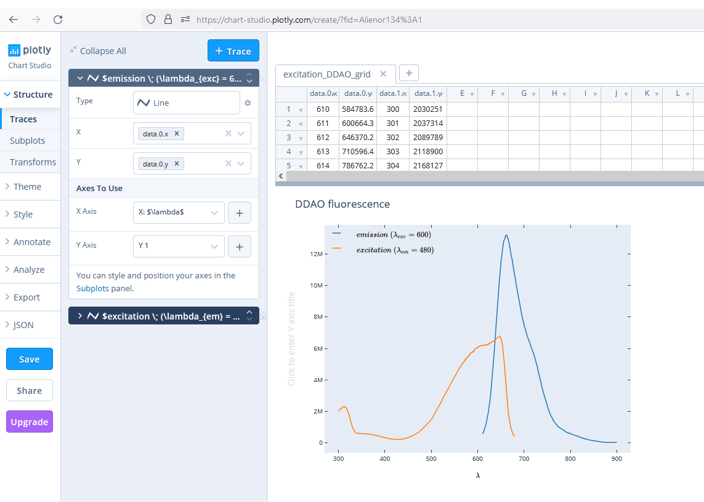
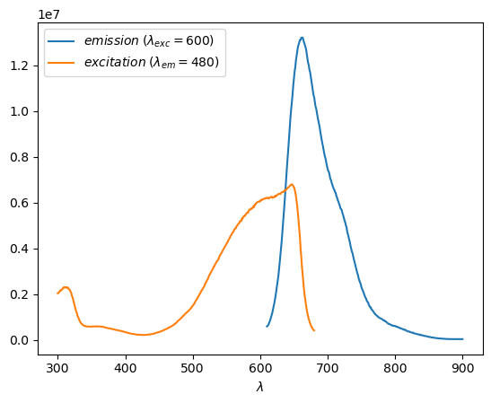

*This readme was generated automatically from a Jupyter notebook using this [tutorial](https://andrewpwheeler.com/2021/09/06/using-jupyter-notebooks-to-make-nice-readmes-for-github/).*

# Introduction

This is a notebook directly inspired from this [tutorial](https://towardsdatascience.com/how-to-create-a-plotly-visualization-and-embed-it-on-websites-517c1a78568b).  
It explains how to publish online a figure generated with matplotlib and its associated data very easily using plotly. It can be usefull to share raw data of figures from scientific papers.   
**Visit the [tutorial](https://towardsdatascience.com/how-to-create-a-plotly-visualization-and-embed-it-on-websites-517c1a78568b) for more details !**




## Step 1: Install plotly and chart studio on a virtual environment


**You can use the virtual environment of this tutorial:**  

``` conda env create -f environment.yml ```

**Otherwise, in conda command prompt:**

```conda install plotly ```  
```conda install -c plotly chart-studio```


## Step 2: Import the data


```python
import plotly.tools as tls

import pandas as pd
import matplotlib.pyplot as plt

```


```python
df = pd.read_csv("data/fluo_DDAO_01_08_2022.csv")
```


```python
fig = plt.figure()
plt.plot(df["Unnamed: 6"], df["Emission_600"], label = r"$emission \; (\lambda_{exc} = 600)$")

plt.plot(df["Unnamed: 2"], df["Excitation_690"], label = r"$excitation \; (\lambda_{em} = 480)$")
plt.xlabel(r"$\lambda$")
plt.ylabel('')
plt.legend()

plt.show()
fig_px = tls.mpl_to_plotly(fig)
```


    

    

## Step 3: Import chart studio


```python
import chart_studio
import chart_studio.plotly as py
```

Fill the credential file with your data (sign-up to chart-studio [here](https://chart-studio.plotly.com/feed/#/), find the API key in the *settings*).


```python
username = "fill your user name here"
api_key = "fill your API key here"

chart_studio.tools.set_credentials_file(username=username, api_key=api_key)
```

## Step 4: Push to chart studio


```python
py.plot(fig_px, filename = 'excitation_DDAO', auto_open=True)
```

Result: https://plotly.com/~Alienor134/1/


